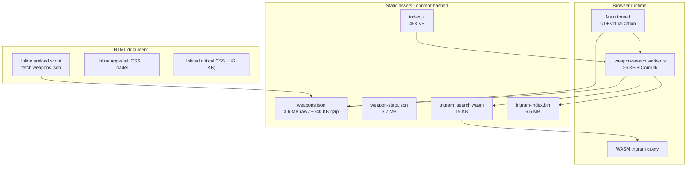

# destiny.report Performance Research

Research date: 2026-06-09  
Scope: **performance only** — no UX, layout, or design recommendations.

## Executive summary

[destiny.report](https://destiny.report) is a Destiny 2 weapon database built as a **client-only SPA** (Vite-style bundling, likely Solid.js) optimized around one idea: **get the weapon catalog parsing and searching off the critical path and off the main thread**.

Their stack is more aggressive than noeyarmory in three places:

1. **Earlier data fetch** — an inline `<script>` starts downloading `weapons.json` before the JS bundle executes.
2. **Off-main-thread search** — a dedicated Web Worker compiles filter queries and runs them against the full catalog.
3. **WASM trigram index** — a prebuilt binary search index (~6.5 MB) narrows text-search candidates before predicate filtering.

noeyarmory already matches or beats them in several areas (browse/detail split, perk interning, `weaponsByPerkName` precompute, `useDeferredValue`, result caps, SSR seeds). The highest-value lessons for us are **preload timing**, **long-lived cache headers on versioned static assets**, and **moving search work to a worker** — not copying their SPA architecture or filter DSL.

---

## What destiny.report is

- Public site: [https://destiny.report](https://destiny.report)
- Focus: weapon browse, DIM-style filter syntax, perk/stat tooling
- Maintainer: SarKurd (same person behind a legacy 2019 Bungie.net fireteam extension — unrelated to the current weapon DB)
- **No public source repo** for the current site; findings below are from live HTTP inspection, response headers, HTML, and downloaded assets.

---

## Architecture overview



### Response headers (useful signals)

| Header | Value | Implication |
|--------|-------|-------------|
| `x-destiny-client-bundle` | `index-CyiM_5Nx.js` | Build/deploy tracks client bundle identity |
| `x-destiny-manifest-version` | Bungie manifest version | Staleness debugging without opening DevTools |
| HTML `cache-control` | `public, max-age=60` | Shell revalidates often; data/assets are immutable |
| Hashed assets `cache-control` | `public, max-age=31536000, immutable` | CDN/browser cache friendly |

---

## Data layer

### Single monolithic catalog file

`weapons.json` (~3.6 MB raw, ~740 KB gzip) contains **everything needed for browse + detail**:

| Top-level key | Contents |
|---------------|----------|
| `manifestVersion` | Bungie manifest version string |
| `generatedAt` | ISO timestamp |
| `weapons` | Dict of ~1,837 weapons keyed by hash |
| `perks` | Dict of ~1,112 perks keyed by plug hash |
| `overlays` | Small metadata (7 entries) |
| `statNames` | Stat hash → display name (28 entries) |

Each weapon record includes browse fields **and** detail fields in one object: `screenshot`, `flavorText`, `stats`, full perk socket definitions (`perks[].plugs` as numeric hashes), `bakedIcon` (self-hosted WebP), `screenshotCut` / `screenshotHash` (precomputed hero layout metadata).

### Secondary data files

| File | Size (approx.) | Role |
|------|----------------|------|
| `weapon-stats.json` | 3.7 MB | Per-weapon stat breakdowns, perk stat mods, masterwork/mod plug catalogs |
| `trigram-index.bin` | 6.5 MB | Prebuilt text-search index (custom `DRT1` binary format) |
| `trigram_search.wasm` | 19 KB | WASM module that queries the trigram index |

### Perk representation

- Perks are **deduplicated in a global dict** (like our `WeaponIndex.perks[]`, but keyed by hash instead of array index).
- Weapon columns store **plug hash arrays**, not resolved perk objects — very compact on disk.
- Reverse perk lookup happens at query time via filter predicates (`perk:`, `exactperk:`, etc.) against the perks dict.

### noeyarmory comparison

| Technique | destiny.report | noeyarmory |
|-----------|----------------|------------|
| Browse/detail split | No — one file | Yes — `weapons.json` + lazy `weapons-detail.json` |
| Perk dedup | Dict by hash | Interned array + column indices |
| `perksLower` stripping | N/A (queries normalized in worker) | Yes — stripped at serialize, rebuilt at load |
| `weaponsByPerkName` | Built at runtime in worker | Precomputed at generate time |
| Screenshot/stats in initial fetch | Yes | No — deferred via `scheduleIdle` + 1.5s delay |
| Self-hosted icons | Yes (`bakedIcon` WebP paths) | No — Bungie CDN at runtime |
| Content-hashed filenames | Yes | No — stable `/data/weapons.json` paths |

**Takeaway:** Our browse/detail split is the right tradeoff for **time-to-interactive** if detail payloads are large. destiny.report pays a bigger upfront JSON cost but avoids a second round trip and simplifies the worker (one load, one in-memory model).

---

## Load performance

### 1. Inline preload (highest-impact pattern)

Before any module JS loads, the HTML contains:

```html
<script>
(() => {
  const urls = ["/assets/public/data/weapons.8c33445bd4d59b2f.json"];
  const store = globalThis.__destinyReportPreloads
    || (globalThis.__destinyReportPreloads = {});
  for (const url of urls) {
    store[url] ??= fetch(url, { credentials: "same-origin" })
      .then(r => { if (!r.ok) throw …; return r.json(); });
  }
})();
</script>
```

The main bundle later reads from `__destinyReportPreloads`, so **JSON download overlaps with JS parse/compile**. In noeyarmory, `WeaponsProvider` only fetches after React hydrates and the effect runs — strictly later in the waterfall.

### 2. Critical CSS inlined

~47 KB of CSS is embedded directly in the HTML (`data-href` points at the external chunk for cacheability). Combined with an inline app-shell loader, first paint does not wait on a CSS network round trip.

### 3. Font strategy

- `rel=preload` for Inter, JetBrains Mono, Destiny Symbols
- `font-display: swap` on all `@font-face` rules
- Self-hosted, hashed font files under `/a/`

### 4. Immutable asset caching

All hashed bundles (`*.js`, `*.css`, `weapons.*.json`) ship with `max-age=31536000, immutable`. HTML alone is short-cached (60s), so deploys propagate quickly while data/assets stay pinned.

### 5. Minimal service worker

`sw.js` is intentionally a no-op (no fetch interception, no offline cache). It exists only to satisfy PWA installability criteria. **No service-worker caching benefit** — performance comes from preload + HTTP cache headers.

### noeyarmory gaps

- `apps/web/next.config.ts` sets security headers but **no cache policy** for `/data/*.json`.
- `WeaponsProvider` fetch starts post-hydration (`apps/web/lib/weapons-context.tsx`).
- No inline shell loader — users see React loading state instead of instant chrome.

---

## Search & filter performance

### Web Worker + Comlink

The main bundle spawns:

```js
new Worker(new URL(`/assets/weapon-search.worker-….js`, import.meta.url))
```

The worker exposes an RPC API (via Comlink):

| Method | Purpose |
|--------|---------|
| `init({ locale, weaponsUrl, wasmUrl, wasmIndexUrl })` | Load catalog, sort weapons, start WASM index load |
| `query(filterString)` | Parse + execute filter, return matching hashes + timing metadata |
| `status()` | Memory + index readiness diagnostics |

A `worker-debug` UI element (dev-facing) surfaces heap usage via `performance.memory`.

### Custom filter DSL (DIM-adjacent)

The worker embeds a full lexer/parser for boolean filter syntax:

- Keywords: `name:`, `perk:`, `exactperk:`, `frame:`, `archetype:`, `season:`, `is:`, `not`, `or`, `and`, …
- AST → compiled predicate functions (`filterWeapons`-style)
- Negation, stat comparisons (`stat:rpm:>=600`), season aliases

This is **not Fuse.js**. Text search is substring/normalized matching, optionally accelerated by the trigram index.

### WASM trigram index (their most distinctive optimization)

On worker `init`, after loading `weapons.json`, the worker asynchronously fetches:

- `/assets/public/spikes/trigram_search.*.wasm`
- `/assets/public/spikes/trigram-index.*.bin`

Flow:

1. Validate binary trailer (`DRTM` metadata) against `manifestVersion` + weapon-count checksum.
2. `WebAssembly.instantiate` the module; copy index bytes into WASM memory.
3. For freeform text queries (`keyword:`, `name:`, `perk:`, etc.), call `wasm.query(fieldId, normalizedText)` → `Uint32Array` of weapon indices.
4. Intersect trigram candidates with compiled filter predicates.
5. Return `{ hashes, elapsedMs, accelerated, candidateCount }`.

If WASM is unavailable or query shape doesn't map to the index, the worker falls back to scanning all ~1,837 weapons.

**Cost:** +6.5 MB download (1h cache on WASM assets vs immutable on main bundles). **Benefit:** sub-millisecond candidate narrowing for text-heavy queries on the full catalog, entirely off the main thread.

### Virtualized rendering

CSS and bundle references confirm virtual scrolling for all browse modes:

- `browse-virtual-spacer` / `browse-virtual-row` for list + tile views
- Fixed row heights (38px rail, 56px compact, 168px tile)
- Only visible rows mount DOM nodes

### noeyarmory comparison

| Technique | destiny.report | noeyarmory |
|-----------|----------------|------------|
| Search thread | Web Worker | Main thread |
| Text search | WASM trigram + substring fallback | Fuse.js (`threshold: 0.3`) |
| Structured filters | Compiled predicates from DSL | `filterWeapons` facet maps + `weaponsByPerkNameRecord` |
| React concurrency | N/A (Solid signals) | `useDeferredValue` on query |
| Result caps | Implicit via UI/worker | Explicit (`MAX_RESULTS=50`, preview caps, Firefox limits) |
| Virtualization | All browse result lists | `@tanstack/react-virtual` only on perk reverse grid (>60 items) |
| Search index build | Precomputed WASM binary at build | Fuse index built in `useMemo` when weapons array changes |

**Takeaway:** Our facet + reverse-perk maps are already efficient for structured filters. The gap is **main-thread occupancy** during typing (Fuse rebuild + filter on ~1.8k weapons) and **lack of virtualization** on large result sets outside the perk page.

---

## Image & media performance

| Approach | destiny.report | noeyarmory |
|----------|----------------|------------|
| Weapon icons | Self-hosted baked WebP (`/icons/baked/…`) | Live Bungie CDN (`<Image unoptimized>`) |
| Screenshots | Bungie paths embedded in JSON | In detail index, lazy-loaded |
| Hero cutouts | Precomputed `screenshotCut` + `screenshotHash` | Not precomputed |
| Watermarks | Bundled paths in JSON | Bungie CDN |

Baked icons remove per-icon DNS/TLS latency and allow immutable caching. Tradeoff: build-time icon pipeline + storage (~1,800 WebPs).

---

## Bundle & runtime comparison

| Asset | destiny.report | noeyarmory (typical) |
|-------|----------------|----------------------|
| Main JS | ~468 KB (single SPA chunk) | Next.js app chunks + React + `@repo/ui` + `@repo/destiny` transpiled |
| Search code | 26 KB worker (separate) | Fuse.js in main bundle |
| Weapon data (initial) | 3.6 MB monolith (preloaded) | `weapons.json` browse index only (smaller); detail separate |
| Extra search index | 6.5 MB WASM binary | None |
| Framework | SPA (no SSR) | Next.js 16 with SSR seeds on `/weapon/[hash]` and `/perk/[hash]` |

noeyarmory's Next.js model adds SSR value (faster first meaningful paint on deep links) that destiny.report does not offer. Any preload/worker work should **preserve** our SSR seeds.

---

## What we should **not** copy

These are architectural or product choices, not performance wins for our constraints:

- **Monolithic JSON** — regresses our browse/detail split unless benchmarks prove detail lazy-load isn't helping.
- **Full SPA rewrite** — unrelated to performance; loses SSR, OAuth server routes, armor vault.
- **DIM filter DSL in the command palette** — UX change; our palette is intentionally simpler.
- **6.5 MB trigram index by default** — high bandwidth cost; only justified if we measure main-thread search latency as a real problem after worker offload.
- **No-op service worker** — marginal PWA benefit, no load-time win.
- **Their visual app shell** — design/UX, out of scope.

---

## Recommended performance plan for noeyarmory

Prioritized by impact vs. invasiveness. None of these require layout or visual design changes.

### P0 — Quick wins (low risk, high leverage)

#### 1. Preload `weapons.json` from root layout

Add a small inline script (or Next.js `beforeInteractive` script) in `apps/web/app/layout.tsx` that starts `fetch("/data/weapons.json")` into a module-level promise — mirror `__destinyReportPreloads`. Update `WeaponsProvider` to consume the existing promise before starting a new fetch.

**Verify:** DevTools waterfall shows JSON download starting before or parallel to main bundle; time-to-searchable unchanged or improved on cold load.

#### 2. Long-cache versioned static data

At generate time, emit content-hashed filenames (e.g. `weapons.<hash>.json`) and a tiny `weapons.manifest.json` with the current path + version. Serve with `Cache-Control: public, max-age=31536000, immutable` via `next.config.ts` `headers()` for `/data/*`.

**Verify:** Repeat visits load weapon index from disk cache; manifest version bump invalidates only the data file.

#### 3. Cache headers for other static JSON

Apply the same policy to `weapons-detail.json`, `weapon-dps.json`, and `armor.json` when hashed.

### P1 — Medium effort (measurable main-thread relief)

#### 4. Move catalog search to a Web Worker

Port `filterWeapons`, facet resolution, and Fuse search into a worker behind a thin Comlink-style API. Keep identical command-palette behavior and result caps — only the execution thread changes.

Suggested interface:

```ts
interface WeaponSearchWorker {
  init(index: SerializedWeaponIndex): Promise<void>;
  search(query: string, filters: WeaponFilters): Promise<SearchResult[]>;
  reversePerk(perkName: string): Promise<number[]>;
}
```

**Verify:** Performance panel shows `<50 ms` Scripting during rapid typing; INP improves on mid-tier Android/Firefox.

#### 5. Extend virtualization to large result lists

Today `VirtualizedWeaponGrid` only activates on `/perk/[hash]` (>60 items). If home browse or search results can render hundreds of `WeaponResultRow`s, apply the same `@tanstack/react-virtual` pattern behind a threshold — same row component, fewer DOM nodes.

**Verify:** Scroll jank absent with 500+ results; Lighthouse TBT stable.

#### 6. Defer non-critical JSON more aggressively

We already idle-load `weapons-detail.json` after 1.5s. Consider also deferring `weapon-dps.json` until first DPS sort or weapon detail open. Pattern matches destiny.report's separation of `weapon-stats.json` from the initial catalog.

### P2 — Higher effort (only if benchmarks justify)

#### 7. Precomputed text search index

Options in increasing complexity:

- **Inverted index JSON** (perk name → weapon hashes) — we partially have this via `weaponsByPerkName`; extend for weapon names/types.
- **Compact binary trigram index** — destiny.report's approach; build in `packages/destiny` generate step; ~MB-scale sidecar.
- **WASM query module** — only if JS worker search still isn't fast enough after P1.

**Gate:** Profile showing Fuse + filter > 16ms median on target hardware with full catalog.

#### 8. Build-time icon baking / CDN proxy

Generate WebP thumbnails for weapon icons at index build time; serve from `/data/icons/` or Vercel blob. Removes Bungie CDN latency and unlocks immutable caching.

**Gate:** Network panel shows icon waterfall dominating LCP on browse pages.

### P3 — Observability & ops

#### 9. Manifest version response header

Expose `x-noeyarmory-manifest-version: <index.version>` on HTML/API responses in production — cheap debugging aid copied from destiny.report.

#### 10. Search timing telemetry (dev-only)

Log `{ query, resultCount, elapsedMs, path: "fuse" | "facet" | "worker" }` behind a dev flag — destiny.report's `worker-debug` pattern without shipping debug UI.

---

## Suggested implementation sequence

```
Phase 1 (1 PR)  → preload promise + cache headers + manifest stub
Phase 2 (1 PR)  → Web Worker search with identical palette behavior
Phase 3 (1 PR)  → Virtualize large search/browse lists (threshold-based)
Phase 4 (spike) → Benchmark: is binary text index needed after Phase 2?
Phase 5 (opt.)  → Icon baking pipeline if network traces warrant it
```

Each phase should be benchmarked on:

- Cold load (no cache) — time until first search returns results
- Warm load — cache hit ratio for data assets
- Typing stress — main-thread long tasks during rapid palette input
- Firefox — already has special-cased caps (`is-firefox.ts`); re-verify after worker move

---

## Benchmark matrix (to run before/after each phase)

| Scenario | Metric | Tool |
|----------|--------|------|
| First visit | JSON start → `WeaponsProvider` ready | Performance waterfall |
| Repeat visit | `weapons.json` from cache (304/200 disk) | Network panel |
| Palette typing | Main-thread blocking time / INP | Performance + Web Vitals |
| Perk reverse page | Scroll FPS with 200+ weapons | Performance monitor |
| Deep link `/weapon/[hash]` | TTFB + hydration (SSR seed intact) | Lighthouse |

---

## Key files referenced

### noeyarmory (current performance architecture)

| Area | Path |
|------|------|
| Client data load | `apps/web/lib/weapons-context.tsx` |
| Idle detail preload | `apps/web/lib/schedule-idle.ts` |
| Server index cache | `apps/web/lib/weapon-index-server.ts` |
| Index generation | `packages/destiny/src/generate.ts`, `intern-weapons.ts` |
| Search logic | `packages/destiny/src/search.ts`, `suggest.ts` |
| Virtualization | `apps/web/components/virtualized-weapon-grid.tsx` |
| Deferred search | `apps/web/hooks/use-weapon-search-results.ts` |
| Next config | `apps/web/next.config.ts` |

### destiny.report (observed endpoints)

| Asset | URL pattern |
|-------|-------------|
| Catalog | `/assets/public/data/weapons.<hash>.json` |
| Stat sidecar | `/assets/public/data/weapon-stats.<hash>.json` |
| WASM | `/assets/public/spikes/trigram_search.<hash>.wasm` |
| Index | `/assets/public/spikes/trigram-index.<hash>.bin` |
| Worker | `/assets/weapon-search.worker-<hash>.js` |

---

## Open questions

1. **Actual noeyarmory `weapons.json` size** — gitignored in dev; need a production generate run to compare byte-for-byte with destiny.report's 3.6 MB monolith (our browse-only file should be smaller).
2. **Whether palette search is a measured pain point** — destiny.report optimizes for always-visible filter bar + full-catalog queries; our palette caps results at 50 and may already be "fast enough."
3. **WASM index build pipeline** — destiny.report references `scripts/build-wasm-trigram-index.ts` in worker error messages; reverse-engineering the `DRT1` format is possible but non-trivial. Treat as a spike, not a default.
4. **Next.js `beforeInteractive` vs inline script** — need to confirm CSP (`script-src 'self'`) allows the preload bootstrap we choose.

---

## Bottom line

destiny.report's performance story is **front-load the catalog, cache it forever, search in a worker, optionally accelerate text with a WASM index, virtualize every long list**. noeyarmory's story is **ship a smaller browse index, lazy-load heavy detail, precompute reverse-perk maps, cap UI work, defer with React concurrency**.

The best imports for us — without touching UX — are:

1. Start fetching weapon data earlier (preload promise).
2. Version and immutably cache generated JSON.
3. Move search off the main thread.
4. Virtualize any list that can render hundreds of rows.

Everything else (WASM trigram index, baked icons, monolithic JSON) is **conditional** on profiling after those four.
