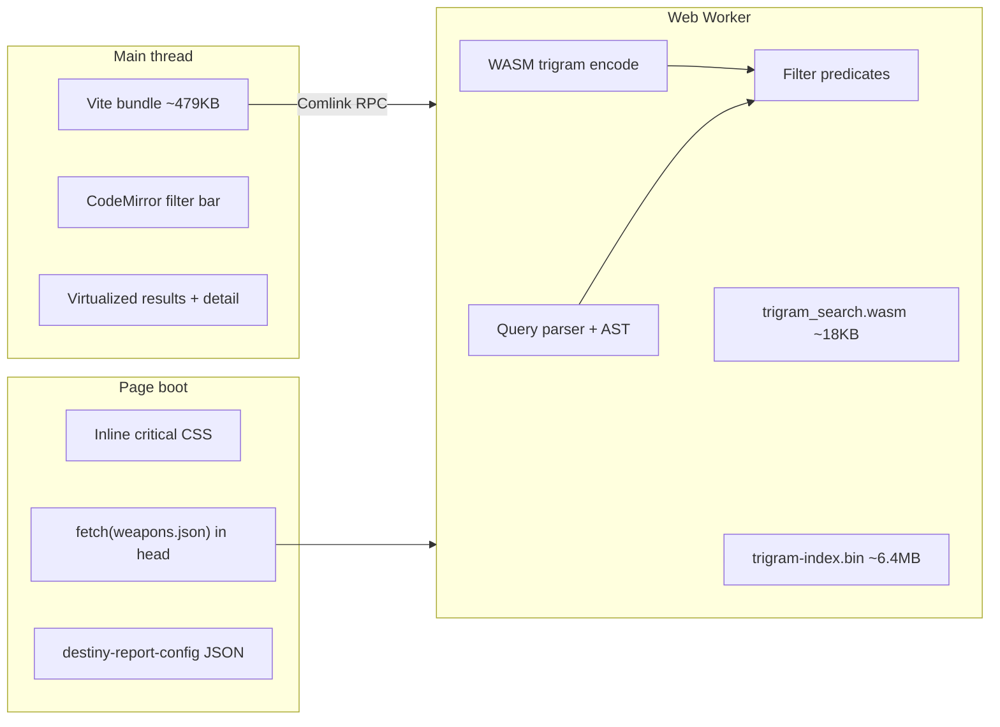

# Destiny.report research — performance, search & index

Research date: **2026-06-09** (revised per product direction)

**Scope:** What [destiny.report](https://destiny.report) teaches us about **search performance**, **index shape**, and **build/runtime architecture** — without changing noeyarmory's command-palette + chip UX.

Primary source: reverse-engineering production assets (HTML config, worker bundle, public JSON/WASM). Secondary: our codebase (`@repo/destiny`, `apps/web`).

---

## Executive summary

destiny.report solves the same core problem we do: flatten the Bungie manifest, search client-side. Where they invest heavily is **making search fast at scale** and **indexing more manifest fields up front** so filters are cheap predicates, not runtime manifest walks.

| Area | destiny.report | noeyarmory today | Takeaway |
|------|----------------|------------------|----------|
| **Initial catalog** | ~3.5MB `weapons.json` preloaded in `<head>` | `weapons.json` fetched in `WeaponsProvider` | Start fetch earlier; consider content-hashed filenames |
| **Text search** | WASM trigram index (~6.4MB) in a worker | fuse.js on main thread | Worker + optional trigram if palette previews lag |
| **Structured filters** | Compiled predicates in worker | `filterWeapons()` full scan on main thread | Same logic, different thread; enrich index fields first |
| **Detail/stats** | Separate `weapon-stats.json` (~3.6MB) | Lazy `weapons-detail.json` after 1.5s idle | Our split is leaner; pull **display stats onto summaries** for search |
| **Filter surface** | DIM query string | Palette categories + chips | **Add categories**, not a new query UI |
| **Index metadata** | source, foundry, breaker, event, holofoil, reissue, … | element, type, perks, frame, craftable, adept (regex) | Biggest functional gap — all mappable to new chips |

**Constraint:** Keep command palette, pills, ghost completion, custom filters, and modal detail. Improvements ship as faster search, richer chip categories, and better build artifacts — not a new browse paradigm.

---

## Their tech stack (what we can learn)

### Runtime architecture



| Component | Their choice | Relevance for us |
|-----------|--------------|------------------|
| **SPA shell** | Vite + client-only routing | We use Next.js — adopt **patterns**, not the framework swap |
| **Worker + Comlink** | All `query()` / filter eval off main thread | Drop-in behind existing `filterWeapons` + fuse APIs |
| **WASM trigram** | Build-time `scripts/build-wasm-trigram-index.ts` → `.bin` + `.wasm` | Optional phase-2 if fuse-in-worker isn't enough |
| **Content-hashed assets** | `weapons.<hash>.json`, config points at current hashes | Long-cache CDN without stale-data bugs |
| **Config injection** | `<script id="destiny-report-config">` with manifest version + asset URLs | Mirror with Next layout/script or `manifest.json` sidecar |
| **Module preload** | Fonts + weapons JSON before JS executes | Next: `<link rel="preload">` or early `fetch` in root layout |
| **PWA** | Empty service worker (install only) | Low priority; unrelated to search perf |

### Data pipeline

| Artifact | Size (observed) | Role |
|----------|-----------------|------|
| `weapons.json` | ~3.5MB | Catalog + interned perks + flags |
| `weapon-stats.json` | ~3.6MB | Display stats keyed by weapon hash |
| `trigram-index.bin` | ~6.4MB | Precomputed text index for fuzzy narrowing |
| `trigram_search.wasm` | ~18KB | Query encoding |

**Total client search payload:** ~13MB before Bungie icons. We currently ship a smaller summary index and lazy-load detail — that's a **real advantage** on first visit. Any trigram/WASM addition should be weighed against that.

### Search pipeline (implementation detail)

1. **Parse** filter string → AST (`and` / `or` / `not` / `filter`).
2. **Compile** AST → predicate function over weapon records.
3. For freeform text legs: **WASM trigram** returns candidate hash list → predicate refines.
4. Return hash list to UI via Comlink.

Our equivalent today (main thread, `use-weapon-search-results.ts`):

1. Optional fuse text narrow (`weaponsMatchingTextQuery`).
2. `filterWeapons(base, weaponFilters, perks)` — O(n) scan per call.
3. `rankWeaponResults` sort.

**Hot path cost for us:** palette **preview** mode can call `filterWeapons` many times per keystroke (hypothetical chips × inline suggestions). Firefox already uses lower preview limits — a signal we're near the comfort ceiling.

---

## Index enrichment opportunities

destiny.report precomputes manifest fields we skip. Each row below is a **candidate `WeaponSummary` field** plus how it surfaces in **existing** palette UX (new category or chip value — no new interaction model).

### High value — new palette categories

| Field | destiny.report | Bungie / build-index source | Palette category idea |
|-------|----------------|----------------------------|------------------------|
| **`sources: string[]`** | `source:trials`, `source:raid`, … (~40 tags) | `collectibles` / item source hashes on `DestinyInventoryItemDefinition` | **Source** — "Trials", "Vault of Glass", "Iron Banner", … |
| **`sourceLabel: string`** | Human drop text in detail | Same + `displayProperties.description` / source records | Detail subtitle only (not a filter chip) |
| **`foundry: string \| null`** | `foundry:hakke`, `foundry:suros` | Item definition foundry identifier | **Foundry** |
| **`breaker: string \| null`** | `breaker:barrier` / overload / unstoppable | Intrinsic / socket champion mod | **Champion** |
| **`event: string \| null`** | `event:dawning`, `event:fotl` | Seasonal event tagging in index build | **Event** (optional; smaller set) |

These answer "where do I farm this?" — a common question our element/type/perk chips don't cover.

### Medium value — boolean / enum chips (extend existing categories)

| Field | Count (DR snapshot) | Notes | Palette mapping |
|-------|----------------------|-------|-----------------|
| **`isAdept`** | 168 | Manifest flag, not name regex | Replace `(Adept|Timelost|Harrowed)` regex in `build-index.ts`; optional **Adept** yes/no under Rarity or standalone |
| **`isHolofoil`** | 90 | Shiny reprise weapons | **Holofoil** yes/no |
| **`isFeatured`** | 321 | Edge of Fate bonus gear | **Featured** yes/no |
| **`isEnhanceable`** | 552 | Weapons with enhanced perk tiers | **Enhanceable** yes/no |
| **`reissueVersion: number`** | 88 | Same hash, new perk pool | **Reissued** yes/no; detail links to sibling versions |
| **`variantOf: number \| null`** | 126 variants | Alternate names (Adept, Timelost, …) | Index-only grouping; detail/version picker, not search chip |

### Search-power fields — enable new filter *types* (still as chips)

| Field | destiny.report filter | Our gap | Implementation |
|-------|----------------------|---------|----------------|
| **Display stats on summary** | `stat:rpm:>=640`, `stat:range:>60` | Stats only in lazy detail | Copy scaled display values into `WeaponSummary` at build time (we already compute these for detail) |
| **`perk1` / `perk2` column** | Column-specific perkname | We have Trait 1 / Trait 2 categories | Already aligned — verify `columnKind()` accuracy for edge archetypes |
| **Negation** | `-is:exotic` | No NOT on chips | Optional later: "exclude" chip variant (same pill UX, inverted predicate) — not a query bar |

### Lower priority for us

| Field | Why deprioritize |
|-------|------------------|
| `pinned:` / `edited:` filters | Session UI feature, not index |
| `light:` / `power:` | Requires profile OAuth — vault milestone |
| `screenshotCut` | Detail presentation only |
| Full DIM query parser | Different UX; we use chips |

---

## destiny.report index schema (reference)

Top-level `weapons.json`:

```ts
{
  manifestVersion: string;
  generatedAt: string;       // ISO — we already have generatedAt
  weapons: Record<hash, Weapon>;
  perks: Record<hash, PerkDef>;
  overlays: OverlayAssets;     // shared MW/crafted/tier sprites
  statNames: Record<hash, string>;
}
```

Per-weapon record (search-relevant fields):

```ts
{
  hash, name, season, tierType, damageType, ammoType, bucketHash,
  typeName, archetype: { hash, name, icon },
  foundry, breakerType, event,
  source: string[],           // e.g. ["trials"]
  sourceString: string,
  stats: Record<statHash, number>,  // display values — on summary for them
  perks: { socketIndex, socketKind, plugs: number[] }[],
  isAdept, isCraftable, isHolofoil, isFeatured, isEnhanceable,
  variantOf?, reissueVersion?,
}
```

### Compared to our `WeaponSummary`

We already do well:

- **Interned perks** + `weaponsByPerkName` reverse index (hash lists, not full objects)
- **`perksLower` stripped on disk**, rebuilt at load (`stripPerksLowerReplacer`)
- **Split detail** (`weapons-detail.json`) — smaller first paint
- **`buildWeaponIndexLookups`** — `byHash`, `perkMap`, `weaponsByPerkName` precomputed

We're missing acquisition/metadata flags and **summary-level stats** for predicate filters.

---

## Performance recommendations

Ordered by impact vs. invasiveness. All preserve palette UX.

### 1. Enrich index first (cheap filters)

**Why:** `filterWeapons` cost is O(n × predicate complexity). Adding `w.source.includes('trials')` is as cheap as `w.element === 'Arc'`. Richer predicates don't hurt if fields are plain scalars on the summary.

**Work:** Extend `build-index.ts` → `WeaponSummary` → `collectFacets` → `weapon-categories.ts` (new categories).

**Verify:** `@repo/destiny` tests; regenerate index; palette shows new categories with counts.

### 2. Move search engine to a Web Worker

**Why:** destiny.report never runs filter evaluation on the main thread. Our preview loop (`use-weapon-search-results.ts`) multiplies work while typing.

**Work:**

- New `packages/destiny/src/search-worker.ts` (or `apps/web/workers/weapon-search.worker.ts`)
- Initialize with serialized `WeaponIndex` or transferable lookup tables
- Expose: `filterWeapons`, `weaponsMatchingTextQuery`, `filterWeaponNames`, `rankWeaponResults`
- Main thread: Comlink or typed `postMessage`; `useDeferredValue` stays for React concurrency
- **Palette API unchanged** — hook swaps implementation

**Verify:** Chrome Performance panel, 6× CPU throttle, type in palette with 3+ chips + preview; compare long tasks before/after.

### 3. Start catalog fetch earlier

**Why:** DR begins `fetch(weapons.json)` in inline `<head>` script before the JS bundle downloads.

**Work (Next.js):**

- Root layout: `<link rel="preload" href="/data/weapons.json" as="fetch" crossorigin />`
- Or mirror DR: inline script that assigns `globalThis.__weaponIndexPreload = fetch(...)`
- `WeaponsProvider` awaits preload promise before starting its own fetch

**Verify:** Network waterfall — weapons.json parallel with JS, not sequential after hydration.

### 4. Content-hashed index filenames

**Why:** DR uses `weapons.8c33445bd4d59b2f.json` + config pointing at current hash → immutable CDN cache.

**Work:**

- `generate.ts` writes `weapons.<contentHash>.json` + `weapons-manifest.json` `{ url, version, generatedAt }`
- App reads manifest first (tiny, short cache) then fetches hashed catalog (long cache)
- Next can keep stable `/data/weapons.json` as redirect/sync alias for dev ergonomics

**Verify:** Deployed cache headers; manifest bump invalidates only catalog, not app JS.

### 5. Precompute facet catalogs at build time

**Why:** `collectFacets(weapons)` and `collectColumnPerks(weapons, perks)` run on every weapons load in `home-search.tsx`.

**Work:**

- Emit `facets` and `columnPerkOptions` in `weapons.json` at generate time
- Client reads precomputed maps; `collectFacets` becomes identity or merge for dynamic data (vault)

**Verify:** Profile React commit after index load — fewer ms in `useMemo` chains.

### 6. Optimize preview path (no worker required)

Quick wins in `use-weapon-search-results.ts` before/alongside worker:

- **Single shared filter pass** for multiple hypothetical chips where possible (union bitmap instead of N full scans)
- **Early exit** when chip set unchanged (stable hash of `chips` + `customFilters`)
- **Cap preview filter sets** uniformly (not only Firefox)
- **Reuse `weaponsByPerkName`** when preview is perk-only — intersect hash sets instead of scanning all weapons

### 7. WASM trigram index (optional, measure first)

**Why:** DR uses trigram narrowing before predicates — sub-ms text leg on ~1.8k weapons.

**When to adopt:** Only if fuse-in-worker still stutters on text search + multi-preview. Cost is ~6MB extra download and build pipeline complexity (`build-wasm-trigram-index.ts` equivalent).

**Work:**

- Build step: trigram index over `name`, `type`, `perks`, `sourceLabel`, flavor (if on summary)
- Worker: encode query via WASM → bitmap/hash list → existing `filterWeapons`

**When to skip:** fuse.js in worker may be sufficient for ~2k weapons; profile first.

### 8. Display stats on `WeaponSummary`

**Why:** Enables stat threshold chips (e.g. category **RPM** with values `≥600`, `≥720`) without loading detail JSON.

**Work:**

- During `build-index.ts`, apply stat-group scaling once, store `{ rpm?, range?, stability?, … }` on summary
- Extend `WeaponFilters` + `filterWeapons` with stat predicates
- New palette categories or numeric chip picker (same pill UX)

---

## Search capability matrix (palette-centric)

What destiny.report filters do that we could match **via chips** (not query strings):

| Capability | DR mechanism | Our path |
|------------|--------------|----------|
| Activity source | `source:trials` | **Source** category |
| Foundry | `foundry:hakke` | **Foundry** category |
| Champion | `breaker:barrier` | **Champion** category |
| Holofoil / Featured / Reissued | `is:holofoil`, etc. | Yes/No chips |
| Stat thresholds | `stat:rpm:>=640` | Summary stats + numeric chips |
| Perk column specificity | `perk1:`, `perk2:` | Existing Trait 1 / Trait 2 |
| Multi-perk AND | implicit AND | Existing `perks[]` chip logic |
| Exclude exotic, etc. | `-is:exotic` | Future: exclude toggle on chip (same pill) |
| Season range | `season:>=20` | Extend **Season** from sort-only to range chips, or keep Newest/Oldest sort |

---

## What we should not copy

| DR pattern | Reason to skip |
|------------|----------------|
| CodeMirror / DIM query bar | Conflicts with palette-first UX |
| Rail + pin + split detail | Layout change, not search perf |
| Monolithic 3.5MB + 3.6MB upfront | Our lazy detail is better for TTFB |
| 6.4MB trigram without profiling | May be overkill at our catalog size |
| Empty service worker | Cosmetic; no search benefit |

---

## Recommended implementation plan

Phases respect **palette UX frozen**. Each phase is independently shippable.

### Phase 1 — Index enrichment (search correctness + new chips)

**Files:** `packages/destiny/src/build-index.ts`, `types.ts`, `search.ts`, `apps/web/lib/palette/weapon-categories.ts`

- [ ] Add `sources`, `sourceLabel`, `foundry`, `breaker`, `event` to `WeaponSummary`
- [ ] Add `isHolofoil`, `isFeatured`, `isEnhanceable`, `reissueVersion`, `variantOf`
- [ ] Replace adept regex with manifest `isAdept` when available
- [ ] Extend `collectFacets` + palette categories: Source, Foundry, Champion, Holofoil, Featured, Reissued
- [ ] Unit tests for new predicates in `filterWeapons`

### Phase 2 — Summary stats for stat chips

**Files:** `build-index.ts`, `search.ts`, `weapon-categories.ts`

- [ ] Store key display stats on `WeaponSummary` (rpm, range, stability, handling, reload, mag)
- [ ] Add `WeaponFilters.statRanges` or per-stat chip category
- [ ] Predicate in `filterWeapons` (no detail fetch required)

### Phase 3 — Search performance (worker + early fetch)

**Files:** new worker module, `use-weapon-search-results.ts`, `weapons-context.tsx`, root layout

- [ ] Web Worker wrapping existing `@repo/destiny/search` functions
- [ ] Head preload / early fetch for `weapons.json`
- [ ] Preview-path optimizations (perk hash intersection, filter-set cap)
- [ ] Benchmark: 6× CPU, 3 chips, rapid typing — target zero >50ms long tasks

### Phase 4 — Build pipeline hardening

**Files:** `generate.ts`, deploy config

- [ ] Content-hashed weapon index + tiny manifest sidecar
- [ ] Precomputed `facets` / column perk options in index JSON
- [ ] Surface `generatedAt` + manifest `version` in sample-data banner (staleness signal)

### Phase 5 — Trigram WASM (only if Phase 3 insufficient)

**Files:** new `packages/destiny/scripts/build-trigram-index.ts`, worker WASM loader

- [ ] Profile-guided: only ship if fuse-in-worker misses targets
- [ ] Lazy-load trigram binary after catalog (don't block first search)

---

## Open questions

1. **Source taxonomy:** Map Bungie `source` hashes to DR's dotted tags (`trials`, `vaultofglass`) — need a single canonical enum in `build-index.ts`.
2. **Stat chip UX:** Range chips (≥600 RPM) vs bucket chips (600–700, 700+) — same palette picker pattern as facets.
3. **Worker + SSR:** Worker is client-only; ensure no regression on `/weapon/[hash]` SSR seeds.
4. **Owned armor search:** Separate plan in `docs/armor-vault-search-improvements.md` (mods, slot, location, stat chips). Not related to destiny.report. Owned weapon rolls are out of scope.

---

## References

- Live app: https://destiny.report
- DR weapons bundle: `https://destiny.report/assets/public/data/weapons.8c33445bd4d59b2f.json`
- Our search hot path: `apps/web/hooks/use-weapon-search-results.ts`
- Our index pipeline: `packages/destiny/src/build-index.ts`, `generate.ts`
- Our vault plan: `docs/vault-search-plan.md`
