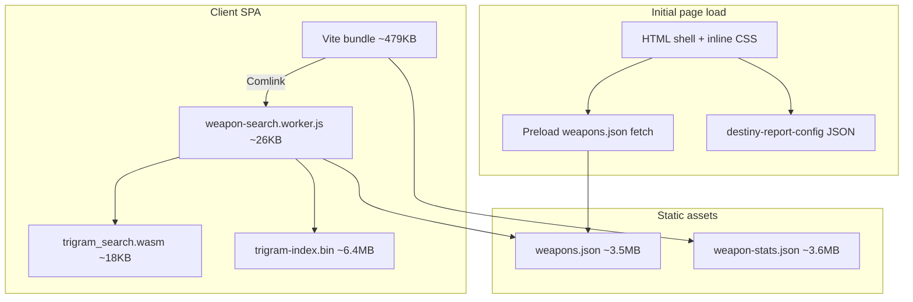

# Destiny.report competitive research

Research date: **2026-06-09**

Primary source: live inspection of [destiny.report](https://destiny.report) (HTML shell, shipped JS bundles, worker code, and public data assets). Secondary context: our own codebase (`@repo/destiny`, `apps/web`).

---

## Executive summary

**destiny.report** is a focused, production-quality **Destiny 2 weapon database** built as a client-side SPA. Its core bet is the same as noeyarmory's weapon mode — flatten the Bungie manifest into a static index and search it in the browser — but it optimizes heavily for **power-user search** (DIM-style query language), **desktop browse workflows** (list/tile/rail + split detail), and **search performance** (Web Worker + WASM trigram index).

It is **not** a vault/account tool today. OAuth/profile hooks exist in filter definitions (`light:` / `power:` are stubbed), but the live product is manifest-only weapon search, roll inspection, and build preview.

**Best lessons for us:**

1. Enrich the weapon index with **source, foundry, breaker, holofoil/featured/reissue** metadata — these unlock filters users already know from DIM.
2. Add a **shareable query language** (or URL-encoded equivalent) without throwing away our command-palette UX.
3. Ship a **rail + detail** layout and **pin/saved-build** persistence for comparison-heavy sessions.
4. Move search/filter off the main thread once the catalog + detail payloads grow.

**Keep our differentiators:** armor vault search + equip/transfer, DPS/ammo-gen sorting, custom named perk filters, and the keyboard-first command palette for casual discovery.

---

## What destiny.report is

| Aspect | Observation |
|--------|-------------|
| **Positioning** | "Search and filter every Destiny 2 weapon by name, perk, frame, archetype, damage type, ammo, and source." |
| **Scope (live)** | Weapon catalog search, perk reverse lookup, interactive roll/build preview, docs pages (`/en/docs/*`). |
| **Scope (historical)** | `archive.destiny.report` was a manifest diff/archive tool; it is **retired** and no longer updated. |
| **Name collision** | An older browser extension "Destiny Report" (SarKurd, ~2019) showed **raid stats on Bungie.net fireteams** — unrelated to the current weapon DB. |
| **Attribution** | Footer: community-built, Bungie API data, not affiliated with Bungie. Ko-fi + Discord links in docs chrome. |

---

## Technical architecture



### Stack signals (from shipped artifacts)

| Layer | Implementation |
|-------|----------------|
| **App shell** | Vite SPA (`index-*.js`), Solid-style reactivity patterns, Base UI–like primitives |
| **Search** | Dedicated **Web Worker**; query parse + filter evaluation in worker |
| **Fuzzy text** | **WASM trigram encoder** + binary index (`scripts/build-wasm-trigram-index.ts` referenced in worker) |
| **Filter UI** | **CodeMirror 6** editor with custom "filter pill" decorations |
| **Data** | Content-hashed JSON under `/assets/public/data/` |
| **PWA** | `manifest.webmanifest` + minimal `sw.js` (installability only — **no caching**) |
| **i18n** | Locale prefix routes (`/en/`, canonical `/en/`) |
| **SEO** | Progressive enhancement: hidden `<main id="seo-fallback">` with real `<form>` + `<h1>` before JS boots |
| **Perf** | Inline critical CSS; font preloads (Inter, JetBrains Mono, Destiny Symbols); weapons.json fetch started in `<head>` |

### Runtime config (embedded in HTML)

```json
{
  "manifestVersion": "243523.26.04.28.2000-3-bnet.64859",
  "weaponsUrl": "/assets/public/data/weapons.<hash>.json",
  "weaponStatsUrl": "/assets/public/data/weapon-stats.<hash>.json",
  "searchWasmUrl": "/assets/public/spikes/trigram_search.<hash>.wasm",
  "searchIndexUrl": "/assets/public/spikes/trigram-index.<hash>.bin"
}
```

Generated timestamp observed in weapons bundle: **2026-06-09** (same day as this research).

---

## Data model comparison

### destiny.report `weapons.json` (top-level)

| Field | Purpose |
|-------|---------|
| `manifestVersion` | Bungie manifest version string |
| `generatedAt` | ISO build timestamp |
| `weapons` | Map of hash → weapon record |
| `perks` | Map of plug hash → perk definition (name, description, icon, …) |
| `overlays` | Shared icon overlays (masterwork, crafted, enhanced, tier tints) |
| `statNames` | Stat hash → display name |

**Scale (2026-06-09 snapshot):** ~1,837 weapon entries, ~1,112 perk defs, ~126 `variantOf` variants, ~88 reissue versions.

### Weapon record highlights (destiny.report)

| Field | Example / notes |
|-------|-----------------|
| `perks[]` | `{ socketIndex, socketKind, plugs: [hash, …] }` — plugs are **indices into `perks` map** |
| `stats` | Map of stat hash → display value |
| `source` | Array of source tags, e.g. `["trials"]` |
| `sourceString` | Human-readable drop text |
| `archetype` | `{ hash, name, icon }` intrinsic frame |
| `foundry` | Normalized foundry id (hakke, suros, …) |
| `breakerType` | Champion breaker enum |
| `event` | Seasonal event id (dawning, fotl, …) |
| Flags | `isAdept`, `isCraftable`, `isHolofoil`, `isFeatured`, `isEnhanceable`, `isTiered` |
| Versioning | `variantOf`, `reissueVersion`, `screenshotCut` for hero framing |

### noeyarmory `@repo/destiny` (today)

| Aspect | Our approach |
|--------|--------------|
| **Catalog shape** | `WeaponSummary[]` (interned perks) + lazy `weapons-detail.json` |
| **Perk columns** | Heuristic `columnKind()` labels (Barrel, Magazine, Trait, …) |
| **Search fields** | Facets: element, type, slot, ammo, rarity, frame, trait1/2, originTrait, craftable, exact name |
| **Multi-perk** | AND across `perks[]`; custom saved groups in localStorage |
| **Missing vs DR** | `source`, `foundry`, `breaker`, `event`, `holofoil`, `featured`, `reissue`/`variant` grouping, stat-range filters |
| **Adept** | Name regex `(Adept|Timelost|Harrowed)` — DR uses manifest flag `isAdept` |

---

## Search & filter system (destiny.report)

### Query language (DIM-adjacent)

Parsed in the worker into an AST with `and`, `or`, `not`, `filter`, and `noop` nodes.

**Syntax features:**

- Implicit AND between terms (`is:arc perkname:outlaw`)
- Explicit `OR`, `AND`, `NOT`, parentheses
- Quoted strings (`perkname:"kill clip"`)
- Block comments `/* … */`
- Negation prefix `-` on filters

**Filter inventory (extracted from worker):**

| Category | Keywords |
|----------|----------|
| **Simple `is:`** | `weapon`, weapon types (`handcannon`, `pulserifle`, …), slots (`kineticslot`, `energy`, `power`), ammo (`primary`, `special`), elements, rarities, `adept`, `craftable`, `enhanceable`, `holofoil`/`shiny`, `featured`/`newgear`, `reissued` |
| **Query `is:`** | `breaker:`, `foundry:`, `event:`, `source:` (~40 activity sources) |
| **Freeform** | `name:`, `exactname:`, `perk:`, `perkname:`, `exactperk:`, `perk1:`, `perk2:`, `frame:`/`archetype:`, `description:`, `keyword:`/`any:` |
| **Stat** | `stat:<stat>:<op><n>` — rpm, range, stability, handling, reload, mag, AA, recoil, … |
| **Range** | `season:`, `year:` (season name aliases like `witch`, `seraph`) |
| **Meta** | `pinned:`, `edited:`/`perked:` (local saved builds) |
| **Stubbed** | `light:` / `power:` (requires profile data) |

**Example queries implied by filters:**

```
is:handcannon source:trials perkname:rangefinder perkname:opening shot
is:arc is:autorifle stat:rpm:>=720 -is:exotic
(perkname:outlaw AND perkname:rampage) OR is:exotic
pinned: edited:
```

### Search pipeline

1. **Structured filters** → compile AST → predicate per weapon.
2. **Freeform `keyword:` / text leg** → WASM trigram index narrows candidate set, then predicate refines.
3. Results returned to main thread via Comlink.

### Filter UI

- CodeMirror editor in the header/filter bar (monospace, pill tokens, autocomplete dropdown).
- Results page adds **example pills** (one-click sample queries) and **refine pills** (click to negate a token).
- Filter state is the **query string** — naturally URL-shareable (they use `/en/weapons/` + `q` param in SEO fallback).

---

## Browse & detail UX (destiny.report)

### Results layouts

| Mode | Behavior |
|------|----------|
| **List** | Dense rows: icon, element, season, type, archetype, RPM (compact mode) |
| **Tile** | Card grid with virtualized rows |
| **Rail** | Left sidebar list; optional **pinned** section; resizable width; active row highlights |

### Persistence (localStorage)

| Key | Purpose |
|-----|---------|
| `dr.pinned-weapons` | Array of weapon hashes pinned in rail |
| `destiny-report.weapon-selections.v1` | Per-weapon selected perk sockets / build state |

Filters `pinned:` and `edited:`/`perked:` read these stores.

### Weapon detail

- **Hero layout**: weapon screenshot with cutout mask (`screenshotCut`), stats column, perk columns, mod row.
- **Interactive build**: click perks to preview stat deltas; layered stat bars (base / socket / perk / MW / negative / behavior).
- **Stat breakdown popover** on hover.
- **Masterwork column** + tier row; **mod row** (square perk tiles).
- **Versions sidebar** when reissues/variants exist.
- **Clarity** community perk text in tooltips (same ecosystem we already use).
- **Pin** control on detail + rail rows.
- `weapon-rail-filter-mismatch` corner flag when a pinned/selected weapon no longer matches the active query.

### Mobile

Below ~1024px, rail collapses — detail becomes full-width; filter inline chips hidden on small screens.

---

## Side-by-side: destiny.report vs noeyarmory

| Dimension | destiny.report | noeyarmory (today) |
|-----------|----------------|---------------------|
| **Primary search UX** | DIM-style query bar (CodeMirror) | Command palette + category chips |
| **Perk AND logic** | `perkname:a perkname:b` (any column) + `perk1:`/`perk2:` column-specific | AND across `perks[]`; trait1/trait2/origin columns |
| **Negation** | `-is:exotic`, refine pill negate | No first-class NOT |
| **Stat filters** | `stat:rpm:>600` | Interactive build preview only (no search) |
| **Source / activity** | `source:trials`, `source:raid`, … | Not indexed |
| **Foundry / breaker** | `foundry:hakke`, `breaker:barrier` | Not indexed |
| **Season** | `season:28`, `season:lawless` aliases | Facet + Newest/Oldest sort |
| **Shareability** | Query string is the filter state | `/weapon/[hash]` share; chip state not in URL |
| **Results UI** | List / tile / rail + split detail | Virtualized list (50→200); detail in **modal** |
| **Pin / compare** | Pin rail + `pinned:` filter | None |
| **Saved builds** | Per-weapon localStorage + `edited:` filter | Custom named perk filters (different model) |
| **Search perf** | Worker + WASM trigram (~6.4MB index) | Main-thread fuse.js over summaries |
| **Data payload** | ~3.5MB weapons + ~3.6MB stats + ~6.4MB index | Split summary + lazy detail |
| **DPS** | Not observed in filter set | DPS sort + benchmark tooltips |
| **Armor** | None | Owned armor search + equip/transfer |
| **Vault weapons** | Stub filters only | Planned (`docs/vault-search-plan.md`); OAuth exists |
| **PWA** | Installable (empty SW) | None |
| **Auth** | None live | Bungie OAuth for armor |

---

## What they do better (steal-worthy)

### 1. Expressive, portable search language

Power users already think in DIM queries. A string like `is:solar is:scoutrifle source:ironbanner perkname:explosive payload` is faster to type, paste into Discord, and bookmark than reconstructing six palette chips.

**Recommendation:** Add an optional **query mode** (toggle or `:` prefix in palette) that parses a DIM subset and syncs to URL `?q=`. Keep chips as the default — compile chip state → query string for sharing.

### 2. Richer manifest flattening

Their index encodes acquisition and build metadata we skip:

- `source` / `sourceString` — "where do I farm this?"
- `foundry`, `breaker`, `event`
- `isHolofoil`, `isFeatured`, `isEnhanceable`
- `variantOf` / `reissueVersion` — version picker UX

**Recommendation:** Extend `build-index.ts` with source tags (reuse Bungie item source hashes), breaker from socket/intrinsic, foundry from item defs. Surfaces: new palette categories + detail chips.

### 3. Desktop browse workflow

Rail + pinned + split detail is excellent for "compare five Hand Cannons with Rangefinder."

**Recommendation:** Add a **Browse** layout on `/` or `/weapons`: optional rail (reuse `WeaponResultRow`), pin set in localStorage, detail panel instead of modal on wide viewports. Modal remains on mobile.

### 4. Search performance architecture

They pay ~6.4MB upfront for instant fuzzy search at scale; evaluation never blocks the UI thread.

**Recommendation:** When catalog + detail growth makes typing laggy (we already cap Firefox previews), port `filterWeapons` + fuse to a **worker**. WASM trigram is optional — measure fuse-in-worker first.

### 5. Stat-aware search

`stat:rpm:>=640` answers a real question ("which aggressive frames hit 640+ RPM?") that build preview alone cannot.

**Recommendation:** Index display stats on `WeaponSummary` (we already compute them in detail). Add `stat:*` filters to query mode or advanced palette facet.

### 6. Product polish details

- SEO fallback form + structured data
- PWA install (trivial empty SW)
- `generatedAt` / manifest version in UI for "is my data stale?"
- Filter mismatch indicator on pinned items
- Three density/view modes

---

## What we already do better (protect)

| Strength | Notes |
|----------|-------|
| **Armor vault** | Live OAuth, owned search, equip/transfer — DR has no equivalent |
| **Command palette** | Lower floor for new users; ghost completion, recent searches, custom filter composer |
| **DPS + ammo gen** | Community spreadsheet integration + sort — DR has stat search but not DPS ranking |
| **Split detail loading** | Smaller initial fetch; DR loads full weapons + stats + trigram index up front (~13MB+) |
| **Next.js SSR** | `/weapon/[hash]` and `/perk/[hash]` are linkable with server seeds |
| **Analytics** | Popular weapons, perk-commit events (optional Redis) |

---

## Recommended plan (for noeyarmory)

Prioritized by user impact vs. effort. No calendar estimates — ordered by dependency and leverage.

### Phase A — Index enrichment (foundation)

**Goal:** Unlock filters and detail chips DR users expect.

- [ ] Add to `WeaponSummary` / `build-index.ts`: `sources[]`, `sourceLabel`, `foundry`, `breaker`, `isHolofoil`, `isFeatured`, `isEnhanceable`, `reissueVersion`, `variantOf`
- [ ] Replace adept regex with manifest-driven flag where available
- [ ] Expose source/foundry/breaker as palette categories
- [ ] Weapon detail: source string + version switcher when variants exist

**Verify:** `pnpm --filter @repo/destiny test`; regenerate index; spot-check Trials + raid weapons.

### Phase B — Shareable search (query language lite)

**Goal:** Discord-friendly URLs without removing the palette.

- [ ] Define a **minimal query grammar** aligned with DR/DIM subset (start with `is:`, `perkname:`, `source:`, `stat:`, implicit AND, `-` negation)
- [ ] Implement parser + compiler → existing `WeaponFilters` struct (or parallel predicate)
- [ ] Sync `?q=` on home; "Copy search link" action
- [ ] Palette ↔ query round-trip for chip selections (best-effort)

**Verify:** Unit tests in `@repo/destiny`; golden queries from DR examples.

### Phase C — Browse layout & session state

**Goal:** Comparison workflow for theorycrafters.

- [ ] Rail view + pin list (`localStorage`)
- [ ] Wide viewport: inline detail panel; narrow: keep modal
- [ ] Persist selected perk build per weapon (reuse DR's model or extend custom filters)
- [ ] `pinned:` / `edited:` as palette filters or query keywords

**Verify:** Storybook / manual desktop + mobile pass.

### Phase D — Search performance

**Goal:** Keep typing instant as index grows.

- [ ] Move `filterWeapons` + fuse search into Web Worker (Comlink or native `postMessage`)
- [ ] Optional: trigram WASM index if worker + fuse insufficient
- [ ] Show manifest `generatedAt` in sample-data banner / settings

**Verify:** Profile palette input on throttled CPU; compare main-thread vs worker.

### Phase E — Vault weapons (existing roadmap)

**Goal:** Leap beyond DR — search **owned rolls**.

- [ ] Execute `docs/vault-search-plan.md` (OAuth already wired for armor)
- [ ] Reuse DR's instanced socket resolution ideas; map to `WeaponDoc`
- [ ] Combine vault + manifest filters (`is:owned`, `perkname:` on rolled perks)

**Verify:** Signed-in dev Bungie app; owned weapon count matches in-game.

### Phase F — Polish & distribution

- [ ] PWA manifest + empty service worker (install to home screen)
- [ ] SEO fallback content on `/` (noscript search form)
- [ ] In-app filter help page mirroring DR's `/en/docs/filters`

---

## Open questions

1. **Open source?** No public repo found for the current destiny.report SPA (unlike the author's separate [DestinyActivityReport](https://github.com/Kigstn/DestinyActivityReport) project). Research relied on reverse-engineering shipped assets.
2. **Profile / vault roadmap?** `light:`/`power:` filters are defined but return false — suggests future signed-in features. Worth monitoring.
3. **Index size budget:** DR ships ~13MB+ client assets before icons. Our split-summary strategy is leaner; any WASM index should be justified by profiling.
4. **Query vs chips:** Do we want full DIM compatibility or a curated subset? Full parity is a large spec; subset covering 90% of weapon queries is probably enough.

---

## References

- Live app: https://destiny.report
- Weapons data (content-hashed): `https://destiny.report/assets/public/data/weapons.8c33445bd4d59b2f.json`
- Retired archive: https://archive.destiny.report (503 at time of research)
- Our vault plan: `docs/vault-search-plan.md`
- DIM search wiki (conceptual neighbor): https://github.com/DestinyItemManager/DIM/wiki/Item-Search-Useful-Queries
